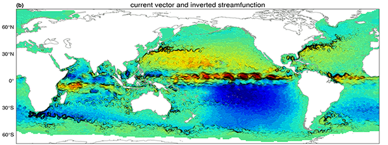
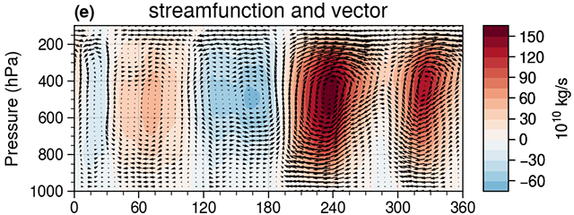
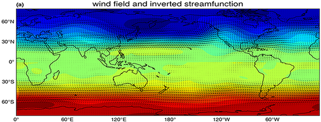
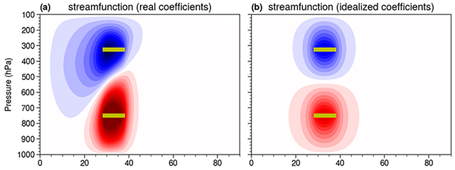
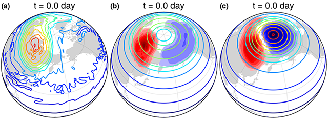
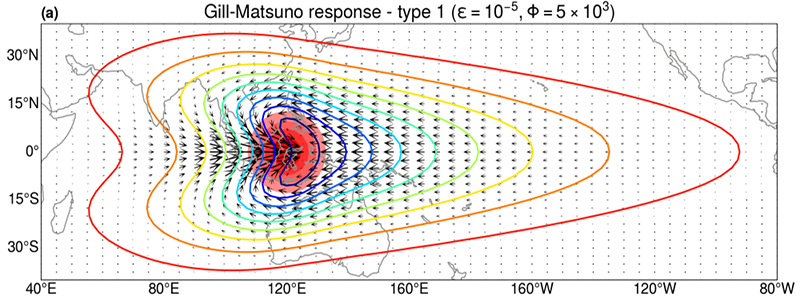
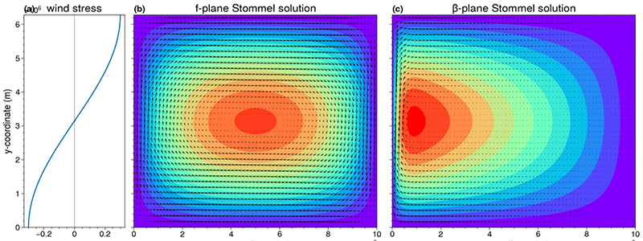
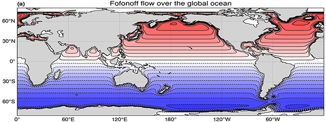
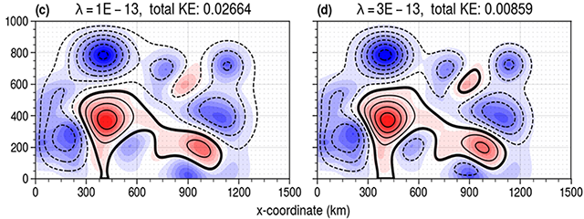
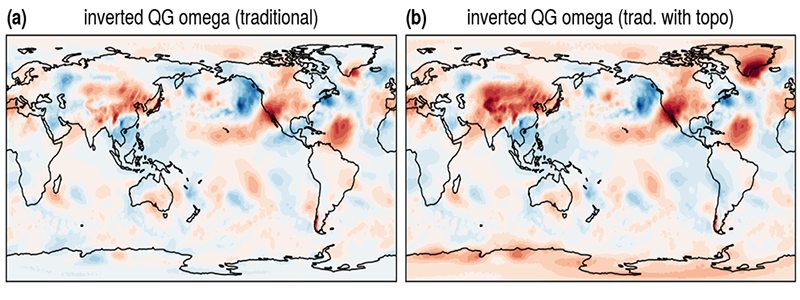

# xinvert

[](https://zenodo.org/badge/latestdoi/323045845)

[](https://xinvert.readthedocs.io/en/latest/?badge=latest)
[](https://badge.fury.io/py/xinvert)

[](https://github.com/miniufo/xinvert/actions/workflows/tests.yml)
[](https://app.travis-ci.com/miniufo/xinvert)


## 1. Introduction
Researches on meteorology and oceanography usually encounter [inversion problems](https://doi.org/10.1017/CBO9780511629570) that need to be solved numerically.  One of the classical inversion problem is to solve Poisson equation for a streamfunction $\psi$ given the vertical component of vorticity $\zeta$ and proper boundary conditions.

> $$\nabla^2\psi=\zeta$$

Nowadays [`xarray`](http://xarray.pydata.org/en/stable/) becomes a popular data structure commonly used in [Big Data Geoscience](https://pangeo.io/).  Since the whole 4D data, as well as the coordinate information, are all combined into [`xarray`](http://xarray.pydata.org/en/stable/), solving the inversion problem become quite straightforward and the only input would be just one [`xarray.DataArray`](http://xarray.pydata.org/en/stable/) of vorticity.  Inversion on the spherical earth, like some meteorological problems, could utilize the spherical harmonics like [windspharm](https://github.com/ajdawson/windspharm), which would be more efficient using FFT than SOR used here.  However, in the case of ocean, SOR method is definitely a better choice in the presence of irregular land/sea mask.

More importantly, this could be generalized into a numerical solver for elliptical equation using [SOR](https://mathworld.wolfram.com/SuccessiveOverrelaxationMethod.html) method, with spatially-varying coefficients.  Various popular inversion problems in geofluid dynamics will be illustrated as examples.

One problem with SOR is that the speed of iteration using **explicit loops in Python** will be **e-x-t-r-e-m-e-l-y ... s-l-o-w**!  A very suitable solution here is to use [`numba`](https://numba.pydata.org/).  We may try our best to speed things up using more hardwares (possibly GPU).

Classical problems include Gill-Matsuno model, Stommel-Munk model, QG omega model, PV inversion model, Swayer-Eliassen balance model...  A complete list of the classical inversion problems can be found at [this notebook](./docs/source/notebooks/Introduction.ipynb).

Why `xinvert`?

- **Thinking and coding in equations:** User APIs are very close to the equations: unknowns are on the LHS of `=`, whereas the known forcings are on its RHS;
- **Genearlize all the steady-state problems:** All the known steady-state problems in geophysical fluid dynamics can be easily adapted to fit the solvers;
- **Very short parameter list:** Passing a single `xarray` forcing is enough for the inversion.  Coordinates information is already encapsulated.
- **Flexible model parameters:** Model paramters can be either a constant, or varying with a specific dimension (like Coriolis $f$), or fully varying with space and time, due to the use of `xarray`'s broadcasting capability;
- **Parallel inverting:** The use of `xarray`, and thus `dask` allow parallel inverting, which is almost transparent to the user;
- **Pure Python code for C-code speed:** The use of `numba` allow pure python code in this package but native speed;

---
## 2. How to install
**Requirements**
`xinvert` is developed under the environment with `xarray` (=version 0.15.0), `dask` (=version 2.11.0), `numpy` (=version 1.15.4), and `numba` (=version 0.51.2).  Older versions of these packages are not well tested.


**Install via conda (~ not yet available ~)**
```bash
conda install -c conda-forge xinvert
```

**Install via pip**
```bash
pip install xinvert
```

**Install from github**
```bash
git clone https://github.com/miniufo/xinvert.git
cd xinvert
python setup.py install
```


---
## 3. Examples:
This is a list of the problems that can be solved by `xinvert`:

|                    Gallery                                |                              descriptions                  |
| :-------------------------------------------------------: | :--------------------------------------------------------: |
|       | [invert<br/> Poisson equation <br/>for<br/> horizontal streamfunction](./docs/source/notebooks/01_Poisson_equation_horizontal.ipynb)  |
|             | [invert<br/> Poisson equation <br/>for<br/> overturning streamfunction](./docs/source/notebooks/02_Poisson_equation_vertical.ipynb) |
|           | [invert<br/> geostrophic equation <br/>for<br/> balanced mass](./docs/source/notebooks/03_Balanced_mass_and_flow.ipynb)          |
|      | [invert<br/> Eliassen model <br/>for<br/> overturning streamfunction](./docs/source/notebooks/04_Eliassen_model.ipynb)     |
| | [invert<br/> PV balance equation <br/>for<br/> steady reference state](./docs/source/notebooks/05_reference_SWM.ipynb)    |
|      | [invert<br/> Gill-Matsuno model <br/>for<br/> wind and mass fields](./docs/source/notebooks/07_Gill_Matsuno_model.ipynb)     |
|      | [invert<br/> Stommel-Munk model <br/>for<br/> wind-driven ocean circulation](./docs/source/notebooks/08_Stommel_Munk_model.ipynb)|
|              | [invert<br/> Fofonoff model <br/>for<br/> inviscid/adiabatic steady state](./docs/source/notebooks/09_Fofonoff_flow.ipynb)|
|          | [invert<br/> Bretherton model <br/>for<br/> steady flow over topography](./docs/source/notebooks/10_Bretherton_flow_over_topography.ipynb)  |
|                | [invert<br/> Omega equation <br/>for<br/> QG vertical velocity](./docs/source/notebooks/11_Omega_equation.ipynb)           |


## 4 Animate the convergence of iteration
One can see the whole convergence process of SOR iteration as:
```python
from xinvert import animate_iteration

# output has 1 more dimension (iter) than input, which could be animated over.
# Here 40 frames and loop 1 per frame (final state is after 40 iterations) is used.
psi = animate_iteration(invert_Poisson, vor, iParams=iParams,
                        loop_per_frame=1, max_frames=40)
```

See the animation at the top.