# xinvert

[](https://doi.org/10.5281/zenodo.7801500)

[](https://xinvert.readthedocs.io/en/latest/?badge=latest)
[](https://badge.fury.io/py/xinvert)

[](https://github.com/miniufo/xinvert/actions/workflows/tests.yml)
[](https://joss.theoj.org/papers/1fc4ac8f98c0778516971880727a3a94)
[](https://app.codacy.com/gh/miniufo/xinvert/dashboard?utm_source=gh&utm_medium=referral&utm_content=&utm_campaign=Badge_grade)


## 1. Introduction
Researches on meteorology and oceanography usually encounter [inversion problems](https://doi.org/10.1017/CBO9780511629570) that need to be solved numerically.  One of the classical inversion problem is to solve Poisson equation for a streamfunction $\psi$ given the vertical component of vorticity $\zeta$ and proper boundary conditions.

> $$\nabla^2\psi=\zeta$$

Nowadays [`xarray`](http://xarray.pydata.org/en/stable/) becomes a popular data structure commonly used in [Big Data Geoscience](https://pangeo.io/).  Since the whole 4D data, as well as the coordinate information, are all combined into [`xarray`](http://xarray.pydata.org/en/stable/), solving the inversion problem become quite straightforward and the only input would be just one [`xarray.DataArray`](http://xarray.pydata.org/en/stable/) of vorticity.  Inversion on the spherical earth, like some meteorological problems, could utilize the spherical harmonics like [windspharm](https://github.com/ajdawson/windspharm), which would be more efficient using FFT than SOR used here.  However, in the case of ocean, SOR method is definitely a better choice in the presence of irregular land/sea mask.

More importantly, this could be generalized into a numerical solver for elliptical equation using [SOR](https://mathworld.wolfram.com/SuccessiveOverrelaxationMethod.html) method, with spatially-varying coefficients.  Various popular inversion problems in geofluid dynamics will be illustrated as examples.

One problem with SOR is that the speed of iteration using **explicit loops in Python** will be **e-x-t-r-e-m-e-l-y ... s-l-o-w**!  A very suitable solution here is to use [`numba`](https://numba.pydata.org/).  In addition, through using [`xarray`](http://xarray.pydata.org/en/stable/)'s [`dask`](https://docs.dask.org/en/latest/) backend for parallel computing, the speed of the inversion could be further improved using multiple CPU cores.  Now, we could also make use of CUDA GPU for further acceleration, with a Red-Black SOR kernel achieving up to **~17× speedup** over the CPU for large grids (measured on an RTX 3090; see the [benchmark docs](https://xinvert.readthedocs.io/en/latest/Benchmark.html)).  See this [notebook](./docs/source/notebooks/Parallel_inversions.ipynb) for more details of CPU/GPU parallel computing, and this [docs](https://xinvert.readthedocs.io/en/latest/Benchmark.html) for benchmark of the inversion speed.

> **Experimental GPU backend:** CUDA support is available for testing and
> evaluation, but is not yet part of xinvert's stable API. Kernel behavior,
> configuration options, and performance characteristics may still change.
> Use the CPU backend for production workflows that require the stable path.

Classical problems include Gill-Matsuno model, Stommel-Munk model, QG omega model, PV inversion model, Swayer-Eliassen balance model...  A complete list of the classical inversion problems can be found at [this notebook](./docs/source/notebooks/00_Introduction.ipynb).

Why `xinvert`?

- **Thinking and coding in equations:** User APIs are very close to the equations: unknowns are on the LHS of `=`, whereas the known forcings are on its RHS;
- **Genearlize all the steady-state problems:** All the known steady-state problems in geophysical fluid dynamics can be easily adapted to fit the solvers;
- **Very short parameter list:** Passing a single `xarray` forcing is enough for the inversion.  Coordinates information is already encapsulated.
- **Flexible model parameters:** Model parameters can be either a constant, or varying with a specific dimension (like Coriolis $f$), or fully varying with space and time, due to the use of `xarray`'s broadcasting capability;
- **Parallel inverting:** The use of `xarray`, and thus `dask` allow parallel inverting, which is almost transparent to the user;
- **Pure Python code for C-code speed:** The use of `numba` allow pure python code in this package but native speed;

---
## 2. How to install
**Requirements**
`xinvert` supports Python 3.9 and newer and requires `xarray`, `dask`, `numpy`, and `numba`. GPU acceleration additionally requires an NVIDIA GPU with a compatible driver/runtime and the maintained `numba-cuda` package.


**Install via pip**
```bash
pip install xinvert
```

**Install GPU support**
```bash
pip install "xinvert[gpu]"                 # existing CUDA runtime
pip install xinvert "numba-cuda[cu12]"    # install CUDA 12 runtime libraries
```

**Install via conda**
```bash
conda install -c conda-forge xinvert
```

**Install from github**
```bash
git clone https://github.com/miniufo/xinvert.git
cd xinvert
python -m pip install .
```


---
## 3. Examples:
This is a list of the problems that can be solved by `xinvert`:

|    Gallery    |    Gallery    |
| :-----------: | :-----------: |
| 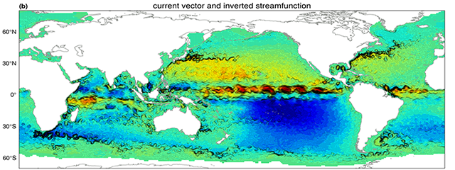<br/>[invert Poisson equation for<br/> horizontal streamfunction](./docs/source/notebooks/01_Poisson_equation_horizontal.ipynb) | 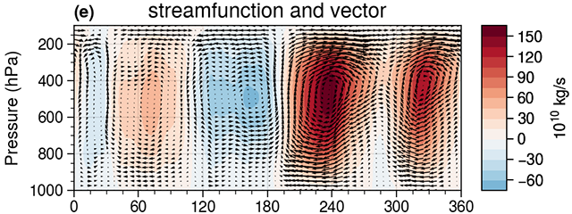<br/>[invert Poisson equation for<br/> overturning streamfunction](./docs/source/notebooks/02_Poisson_equation_vertical.ipynb) |
| 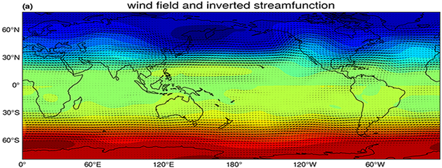<br/>[invert geostrophic equation for<br/> balanced mass](./docs/source/notebooks/03_Balanced_mass_and_flow.ipynb) | 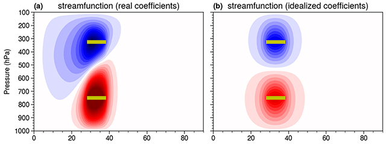<br/>[invert Eliassen model for<br/> overturning streamfunction](./docs/source/notebooks/04_Eliassen_model.ipynb) |
| 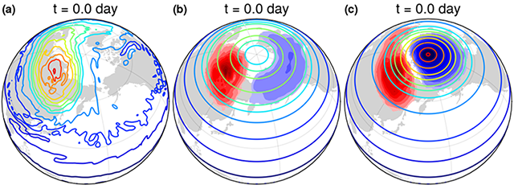<br/>[invert PV balance equation for<br/> steady reference state](./docs/source/notebooks/05_reference_SWM.ipynb)| 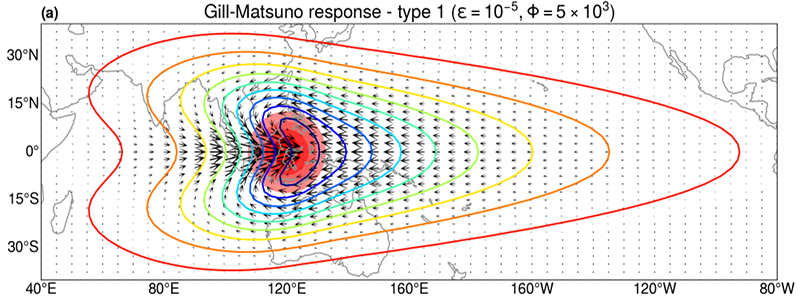<br/>[invert Gill-Matsuno model for<br/> wind and mass fields](./docs/source/notebooks/07_Gill_Matsuno_model.ipynb) |
| 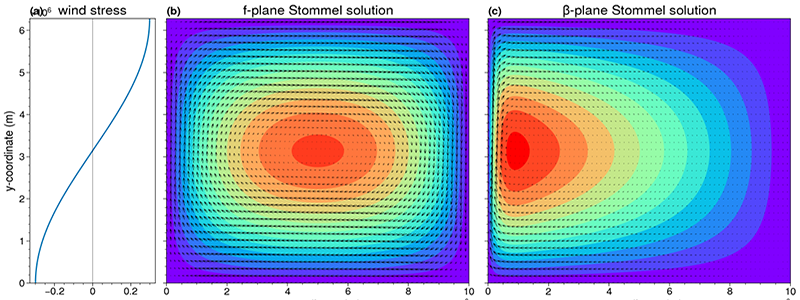<br/>[invert Stommel-Munk model for<br/> wind-driven ocean circulation](./docs/source/notebooks/08_Stommel_Munk_model.ipynb) | 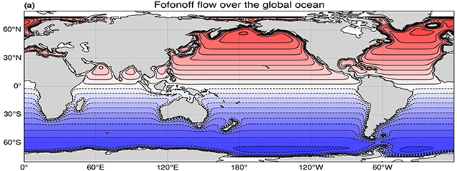<br/>[invert Fofonoff model for<br/> inviscid/adiabatic steady state](./docs/source/notebooks/09_Fofonoff_flow.ipynb) |
| 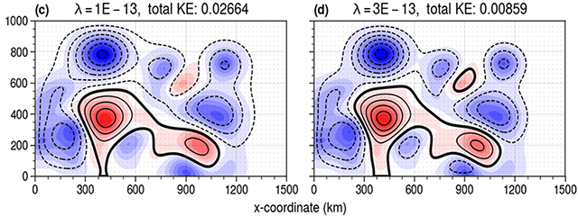<br/>[invert Bretherton model for<br/> steady flow over topography](./docs/source/notebooks/10_Bretherton_flow_over_topography.ipynb) | 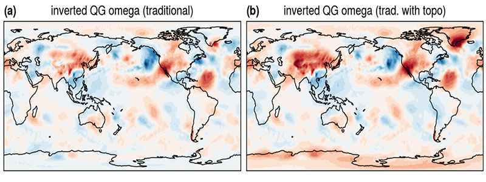<br/>[invert Omega equation for<br/> QG vertical velocity](./docs/source/notebooks/11_Omega_equation.ipynb) |
| 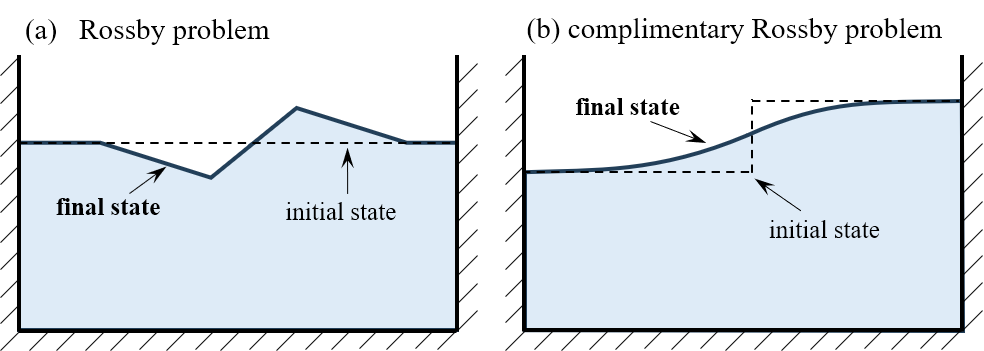<br/>[invert geostrophic-adjustment problem](./docs/source/notebooks/12_GeostrophicAdjustment.ipynb) | ... add more examples ... |


## 4 Animate the convergence of iteration
One can see the whole convergence process of SOR iteration as:
```python
from xinvert import animate_iteration

# output has 1 more dimension (iter) than input, which could be animated over.
# Here 40 frames and loop 1 per frame (final state is after 40 iterations) is used.
psi = animate_iteration(invert_Poisson, vor, iParams=iParams,
                        loop_per_frame=1, max_frames=40)
```

See the animation at the top.

For accuracy-sensitive inversions, the optional preconditioned-residual
stopping criterion avoids false convergence caused by an unchanged global
solution norm:

```python
iParams = {
    'tolerance': 1e-8,
    'convergence': 'residual',  # default 'norm' keeps legacy behaviour
}
psi = invert_Poisson(vor, dims=['lat', 'lon'], iParams=iParams)
```

To inspect termination status programmatically, opt in to structured
diagnostics.  The default return value remains unchanged:

```python
iParams['return_diagnostics'] = True
psi, diagnostics = invert_Poisson(
    vor, dims=['lat', 'lon'], iParams=iParams)

print(diagnostics.converged.item())
print(diagnostics.iterations.item())
print(diagnostics.error.item())
print(diagnostics.stop_reason.item())  # 'converged', 'max_iterations', ...
```

For inputs with non-solver dimensions such as `time` or `member`, every
diagnostic variable retains those dimensions and reports each inversion
independently.  This also works with Dask-backed arrays.


## 5 Cite

If you use the package in research, teaching, or other activities, we would be grateful
if you mention `xinvert` and cite our paper in JOSS:

```bibtex
@article{Qian2023,
    doi = {10.21105/joss.05510},
    url = {https://doi.org/10.21105/joss.05510},
    year = {2023},
    publisher = {Journal of Open Source Software},
    volume = {8},
    number = {89},
    pages = {5510},
    author = {Yu-Kun Qian},
    title = {xinvert: A Python package for inversion problems in geophysical fluid dynamics}, journal = {Journal of Open Source Software}
}
```
