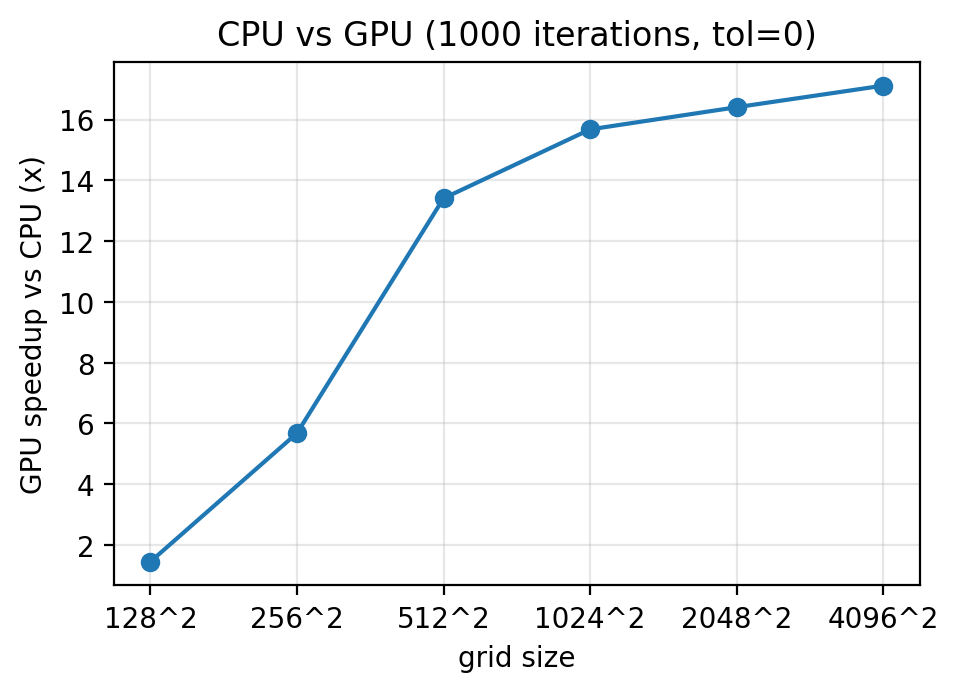
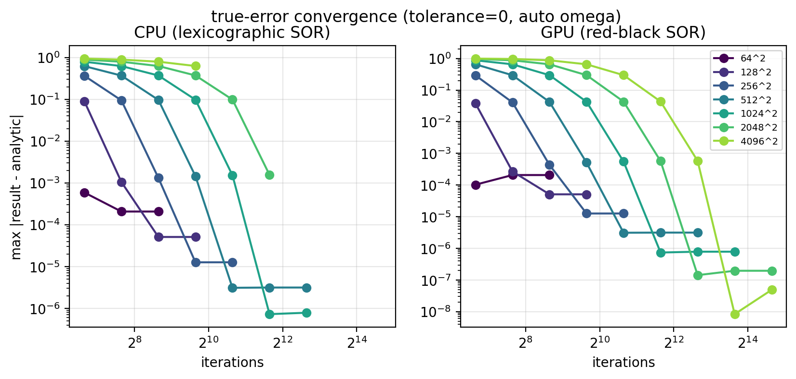
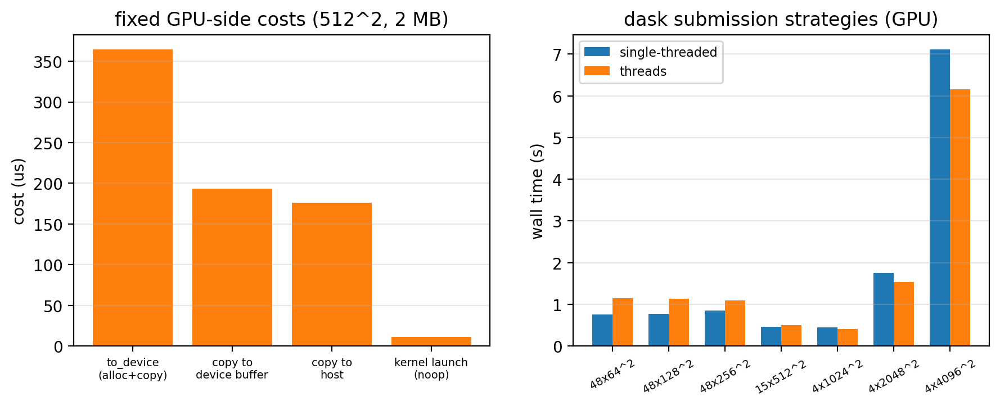
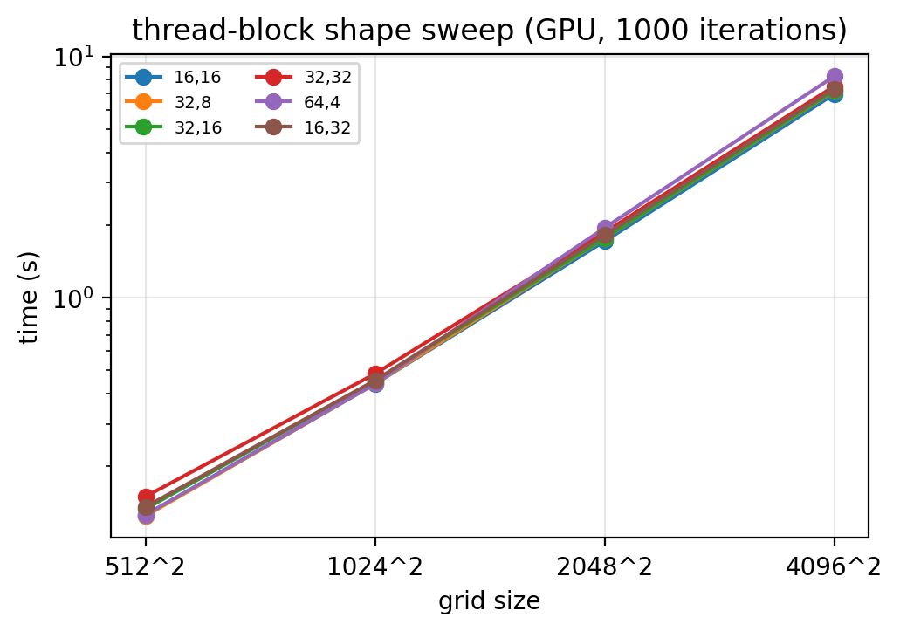

.. xinvert GPU benchmark documentation

GPU Benchmark
=============

This page documents the GPU performance of xinvert's Red-Black SOR solver,
the optimisations applied, and how to reproduce the measurements.

Hardware
--------

* CPU: x86_64
* GPU: NVIDIA GeForce RTX 3090 (82 SMs, compute capability 8.6)
* Software: Python 3.13, numba / numba-cuda

Benchmark method
----------------

The benchmark solves a synthetic Poisson equation with a known analytic
solution (:math:`\psi = \sin(\pi x)\sin(\pi y)`) on square grids from
128×128 up to 4096×4096.

Both CPU and GPU run a **fixed 1000 iterations** (``tolerance=0``) so that
they do exactly the same amount of work.  The speedup therefore reflects
pure per-iteration throughput, not "who converged first".  Timings include
host↔device data transfer for the GPU.

Results were collected across two sessions: **2026-07** (initial GPU port,
speedups, block sweep) and **2026-09-19** (convergence comparison, GPU
fixed-cost micro-benchmark, dask submission strategies).  All benchmark
scripts live in ``tests/`` and figures are regenerated by
``tests/plot_benchmarks.py``.

Reproduce::

    python tests/benchmark_cpu_gpu.py 128 256 512 1024 2048 4096

Results
-------

.. list-table::
   :header-rows: 1
   :widths: 18 15 15 12 15 15

   * - Grid
     - CPU (s)
     - GPU (s)
     - Speedup
     - CPU error
     - GPU error
   * - 128×128
     - 0.103
     - 0.071
     - 1.45×
     - 5.10e-05
     - 5.10e-05
   * - 256×256
     - 0.423
     - 0.075
     - 5.68×
     - 1.26e-05
     - 1.26e-05
   * - 512×512
     - 1.684
     - 0.126
     - 13.41×
     - 1.40e-04
     - 4.71e-05
   * - 1024×1024
     - 6.762
     - 0.431
     - 15.68×
     - 4.01e-02
     - 1.51e-02
   * - 2048×2048
     - 28.008
     - 1.707
     - 16.41×
     - 2.79e-01
     - 1.89e-01
   * - 4096×4096
     - 116.814
     - 6.825
     - 17.12×
     - —
     - —

The speedup grows with grid size and saturates near 17×, because larger
grids amortise the fixed per-iteration overhead (kernel launch, host
synchronisation, data transfer).

.. note::

    At large grids (512+) with ``optArg ≈ 2.0`` SOR over-relaxation has not
    fully converged in 1000 iterations, so the error grows with grid size
    for **both** back-ends.  This is expected and does not indicate an
    implementation bug; the speedup comparison remains valid (equal work).

    CPU uses standard SOR (Gauss-Seidel); GPU uses Red-Black SOR (required
    for parallelism).  Both converge to the same fixed point; small
    per-iteration differences exist but the final result agrees.

Correctness verification
------------------------

``tests/test_CpuGpuConsistency.py`` verifies CPU↔GPU consistency on a
51×41 Poisson problem (``mxLoop=20000``, ``tolerance=1e-10``)::

    CPU  max error vs analytic: 4.216179e-04
    GPU  max error vs analytic: 4.216176e-04
    CPU-GPU max diff:           9.367749e-10
    RESULT: PASS

Convergence: CPU (lexicographic) vs GPU (red-black)
---------------------------------------------------

The CPU kernels sweep the grid in lexicographic order (in-place updates,
"wavefront" propagation), the GPU uses red-black ordering
(parallel-friendly, no wavefront).  True error vs the analytic solution
(psi = sin(pi x) sin(pi y), cartesian Poisson, tolerance=0) at matched
iteration counts:

.. list-table::
   :header-rows: 1
   :widths: 12 18 18 18 18

   * - iters
     - CPU err (128^2)
     - GPU err (128^2)
     - CPU err (513^2)
     - GPU err (513^2)
   * - 100
     - 9.01e-02
     - 3.81e-02
     - 6.23e-01
     - 6.52e-01
   * - 400
     - 5.10e-05
     - 5.10e-05
     - 9.68e-02
     - 4.22e-02
   * - 1600
     - 5.10e-05
     - 5.10e-05
     - 3.10e-06
     - 3.12e-06
   * - 6400
     - 5.10e-05
     - 5.10e-05
     - 3.15e-06
     - 3.15e-06

**Finding**: in true-error terms the red-black GPU kernel reaches the
analytic solution **as fast or faster** than the lexicographic CPU kernel
at essentially every checkpoint (128^2: 2.4x better at 100 iterations;
513^2: 2.3x better at 400 iterations), and both converge to the same
error level at each grid size.  The full sweep (grids 64-4096, iterations
100-25600) is in ``tests/results/convergence.json``.

**Caution — the ``|Δnorm| < tolerance`` stopping criterion is not a
reliability proxy for the true error**: at 513² with the auto-computed
omega (≈1.988), the CPU satisfied ``|Δnorm| < 1e-6`` at iteration 1007
while its true error (1.3e-4) was still **~40× above** its achievable
floor (3.1e-6) — heavy over-relaxation makes the norm oscillate, so
consecutive norms can nearly coincide long before the error has decayed.
For accuracy-critical runs on large grids, set ``tolerance`` well below
the intended accuracy or enforce a minimum ``mxLoop``.

GPU fixed costs & dask submission (session 2026-09-19)
------------------------------------------------------

Micro-benchmark of the fixed GPU-side costs (512x512 float64 = 2 MB,
``tests/benchmark_gpu_overheads.py``):

.. list-table::
   :header-rows: 1
   :widths: 55 25

   * - operation
     - cost (us)
   * - ``to_device`` (device alloc + H2D copy)
     - 347.5
   * - ``copy_to_device`` into an existing buffer
     - 184.8
   * - ``copy_to_host``
     - 167.8
   * - kernel launch (noop)
     - 9.4

Device allocation adds ~160 us on top of the raw copy, and every kernel
launch costs ~10 us regardless of size -- the reason small-grid solves are
launch-bound and why per-time-step batching (one 3-D kernel over all time
steps) is the main remaining optimisation for small problems.

Dask submission strategies (``tolerance=0``, 48 slices,
``tests/benchmark_gpu_overheads.py``): running the per-time-step GPU solves
concurrently from dask threads is **slower** for small grids (kernels
serialise on the default stream and the blocking convergence-check syncs
create a convoy effect) while each in-flight solve holds ~5 device buffers
in VRAM.  GPU solves are therefore bounded to one at a time
(``gpus._GPU_MAX_CONCURRENT``), which also lets dask pipeline disk I/O
(e.g. ``to_netcdf``) against the GPU solves.

Resolution scaling (session 2026-09-19)
~~~~~~~~~~~~~~~~~~~~~~~~~~~~~~~~~~~~~~~

Upsampling the SODA curl field 2x and 4x (600x1440, 1200x2880;
``tests/benchmark_resolution.py``, fixed 5000 iterations, 12 time steps)
shows how the fixed launch overhead fades as grids grow:

.. list-table::
   :header-rows: 1
   :widths: 30 20 20 20

   * - resolution
     - per-iteration
     - launch share
     - GPU 12 slices
   * - 300x720 (216k pts)
     - 87 us
     - 32%
     - 4.91 s
   * - 600x1440 (864k pts)
     - 178 us
     - 16%
     - 10.75 s
   * - 1200x2880 (3.46M pts)
     - 641 us
     - 4%
     - 39.51 s

Kernel execution grows with the point count while the launch cost stays
fixed, so the launch share collapses from 1/3 to 1/25.  At the native SODA
resolution the GPU spends a third of every iteration waiting for the host
to issue the next kernel -- the worst case for the GPU, and the reason the
sequential GPU only beats 12-core dask CPU by 1.58x (21.77 s vs 34.32 s at
mxLoop=20000, tol=1e-15).

Why one launch per timestep is not enough
~~~~~~~~~~~~~~~~~~~~~~~~~~~~~~~~~~~~~~~~~

Each SOR iteration needs a grid-wide synchronisation between the red and
black updates (black reads the fresh red values), and between iterations.
On the GPU that synchronisation is the kernel boundary itself -- hence
3 launches per iteration (boundary + red + black) and 60200 launches for
one 20000-iteration solve.  Alternatives, in order of practicality:

1. **Relax the stopping criterion** -- tolerance=1e-15 forces the full
   20000 iterations; the solution is already accurate to ~1e-6 by
   iteration 6400.  Zero code, ~4x faster.
2. **Time-batched kernel** -- one 3-D kernel covering all time steps per
   colour: launch count divided by the number of time steps, and each
   launch is large enough to fill the GPU.
3. **CUDA graph capture** -- record the kernel sequence once, replay with
   much lower per-launch cost.  Works with the existing kernels but needs
   cuda-python plumbing.
4. **Persistent kernel** -- launch once and iterate on-GPU with a
   software grid barrier.  numba.cuda lacks cooperative groups, the
   software barrier costs about as much as a launch, and the co-residency
   deadlock risk makes this the least attractive option.

Launch overhead vs resolution
-----------------------------

The micro-benchmark above measures launch cost in isolation; the question that
matters for xinvert is how large a share of a real solve it is.  That depends
entirely on the grid: each SOR iteration launches 3 kernels (2 Red-Black SOR +
1 boundary extend), so the fixed cost per iteration does not change with grid
size while the arithmetic does.

``tests/benchmark_resolution.py`` upsamples the SODA curl 1x/2x/4x and
instruments a single slice at each resolution (``mxLoop=5000``,
``tolerance=0``, 20 convergence checks), giving
``tests/results/resolution_scaling.json``:

.. list-table::
   :header-rows: 1
   :widths: 22 16 18 20 22

   * - grid
     - points
     - us / iteration
     - launch share
     - convergence checks
   * - 300 x 720
     - 216 k
     - 87.0
     - **32.5 %**
     - 0.024 s
   * - 600 x 1440
     - 864 k
     - 177.7
     - **15.9 %**
     - 0.500 s
   * - 1200 x 2880
     - 3.46 M
     - 639.6
     - **4.4 %**
     - 2.825 s

The launch share is ``n_launches x 9.4 us / loop time``, i.e. the fraction of
the loop that the GPU spends launching rather than executing.  It falls from
**a third to under 5 %** as the grid grows: at 216 k points a kernel runs at
roughly the same scale as its own launch cost, so launch overhead is a real
constraint, while by 3.46 M points the kernels are long enough that it no
longer matters.

Per-iteration cost grows only **7.4x for a 16x increase in points**, so the
kernels are not scaling with the work they do -- at this size they are
execution-bound (memory bandwidth), not launch-bound.

Note on the last column: the convergence check is a *blocking* device-to-host
read, so it is also the point at which the asynchronous launch queue drains.
As kernels get longer the queue backs up between checks, and the check absorbs
more of the wall time -- 5 % of the loop at 216 k points versus 88 % at
3.46 M.  That is a consequence of the drain, not of the reduction kernel being
slow; ``t_sync`` = ``t_loop`` means the GPU was saturated the whole time.

Practical consequence: for the small grids where launch overhead bites, the
lever is **fewer, larger launches** -- processing several timesteps per kernel
launch, or fusing the boundary extend into the SOR kernel.  For large grids the
lever is reducing the *iteration count* (multigrid, preconditioning), which is
the algorithmic direction noted below.

Benchmark and regression scripts live in ``tests/``:
``benchmark_cpu_gpu.py``, ``benchmark_blocks.py``, ``benchmark_convergence.py``,
``benchmark_gpu_overheads.py``, ``benchmark_gpu_scaling.py``,
``benchmark_resolution.py``, ``test_distributed.py`` (dask.distributed
serialisation), ``test_jupyter_printinfo.py`` (Jupyter printInfo regression).
``plot_benchmarks.py`` regenerates the figures in this document from
``tests/results/*.json``.

Optimisations applied
---------------------

The GPU wrapper went through several optimisation rounds.  All changes are
in ``xinvert/gpus.py``.

Round 1 — sparse convergence checking
~~~~~~~~~~~~~~~~~~~~~~~~~~~~~~~~~~~~~~

On non-check iterations only the Red + Black update kernels run; the norm
reduction kernel and host sync are skipped.  This cut the host-device
synchronisation cost dramatically.

Round 2 — adaptive check interval
~~~~~~~~~~~~~~~~~~~~~~~~~~~~~~~~~~

``_compute_check_interval(mxLoop, tolerance)`` scales the check interval with
the total iteration budget so the number of host-device synchronisations
stays roughly constant regardless of problem size:

- ``tolerance > 0`` (real convergence): ``clamp(mxLoop/50, 10, 100)``
- ``tolerance ≤ 0`` (fixed-iter / benchmark): ``clamp(mxLoop/20, 50, 500)``

This benefits large iteration counts the most — e.g. 10000 iterations need
only ~20 synchronisations (same as 1000), so the speedup grows with
iteration count:

.. list-table::
   :header-rows: 1

   * - mxLoop (512², tol=0)
     - CPU (s)
     - GPU (s)
     - Speedup
   * - 1000
     - 1.69
     - 0.14
     - 11.9×
   * - 10000
     - 16.96
     - 0.99
     - 17.1×

Round 2 also extracted the convergence-evaluation logic into
``_evaluate_gpu_norm(...)`` and the interval logic into
``_compute_check_interval(...)``, both dimension-agnostic, so future 3-D /
general / biharmonic GPU wrappers can reuse the same loop skeleton.

Round 3 — boundary-kernel consolidation & block configurability
~~~~~~~~~~~~~~~~~~~~~~~~~~~~~~~~~~~~~~~~~~~~~~~~~~~~~~~~~~~~~~~

* Folded the four-corner handling into ``_extend_x_boundary``, removing a
  separate single-block kernel launch (which emitted a ``Grid size 1``
  under-utilisation warning) and saving one kernel launch per iteration.
* Made the 2-D thread-block shape configurable per call (originally via the
  ``XINVERT_GPU_BLOCK2D`` env var, since removed — now via
  ``iParams['gpu_block2d']``).

Round 4 — adaptive 1-D block size (simplification)
~~~~~~~~~~~~~~~~~~~~~~~~~~~~~~~~~~~~~~~~~~~~~~~~~~~~

The 1-D boundary/norm kernels previously took a user-configurable block
size via the ``XINVERT_GPU_BSIZE1D`` env var (default 256) and a matching
``gpu_bsize1d`` ``iParams`` entry.  Since these kernels are **not** on the
hot loop (the 2-D SOR iteration dominates total time), the 1-D block size
has negligible effect on runtime.  The env var and the ``iParams`` entry
were removed in favour of an internal adaptive selector,
``_auto_bsize_1d(n)``:

.. list-table::
   :header-rows: 1
   :widths: 40 20 40

   * - Boundary extent *n*
     - Block size
     - Rationale
   * - ``n < 64``
     - 32
     - single warp; avoids grid = 1 under-utilisation
   * - ``64 ≤ n < 512``
     - 128
     - 2–4 blocks, SMs start to fill
   * - ``n ≥ 512``
     - 256
     - sweet spot for all larger sizes

Each boundary kernel now picks its block size from the extent it actually
sweeps (``xc`` for the y-boundary kernel, ``yc`` for the x-boundary kernel).
Users no longer need to tune a 1-D block parameter — the only remaining
GPU tuning knob is ``gpu_block2d`` in ``iParams``.

Thread-block shape sweep
------------------------

A sweep over six block shapes (``tests/benchmark_blocks.py``) tested whether
warp-coalesced thin blocks (``32×8``) beat square blocks (``16×16``).

.. list-table::
   :header-rows: 1
   :widths: 15 14 14 14 14 14 14

   * - Grid
     - 16×16
     - 32×8
     - 32×16
     - 32×32
     - 64×4
     - 16×32
   * - 512×512
     - 0.1251
     - 0.1244
     - 0.1331
     - 0.1498
     - 0.1258
     - 0.1356
   * - 1024×1024
     - 0.4392
     - 0.4403
     - 0.4526
     - 0.4837
     - 0.4403
     - 0.4536
   * - 2048×2048
     - 1.7139
     - 1.7616
     - 1.7638
     - 1.8657
     - 1.9462
     - 1.8159
   * - 4096×4096
     - 6.9775
     - 7.1847
     - 7.2191
     - 7.5225
     - 8.2796
     - 7.3437

**Finding**: the square ``(16, 16)`` block is ~3 % faster than the
warp-coalesced ``(32, 8)`` at 4096².  Coalescing theory predicts ``(32,8)``
wins for row-stride access, but the SOR stencil accesses neighbours in
**both** x and y, so square blocks give better 2-D cache locality.  Large
blocks (``32×32`` = 1024 threads) reduce occupancy and are consistently
slowest.

The default remains ``(16, 16)``; override per call via
``iParams['gpu_block2d'] = (32, 8)``.

Reproduce the sweep::

    python tests/benchmark_blocks.py 128 256 512 1024 2048 4096

Axis-mapping (coalescing) experiment
-------------------------------------

The 2-D SOR stencil reads ``S[j, i]`` and its eight neighbours.  Because
the array is C-contiguous (row-major), a warp whose ``threadIdx.x`` maps to
``j`` (the default ``j, i = cuda.grid(2)``) reads with stride ``xc`` —
*uncoalesced*.  A flipped mapping (``i, j = cuda.grid(2)``) makes
``threadIdx.x`` map to ``i``, the contiguous axis, so a warp's reads of
``S[j, i]`` become consecutive addresses — fully *coalesced*.  Coalescing
theory predicts the flipped mapping should be faster for memory-bound
stencils.

A benchmark compared the two mappings through the real ``invert_Poisson``
path, isolating coalescing as the only variable (identical kernel body,
only the ``grid()`` unpack order differs):

.. list-table::
   :header-rows: 1
   :widths: 22 20 20 18

   * - Grid
     - Original (s)
     - Flipped (s)
     - Speedup
   * - 256×256
     - 0.0796
     - 0.0760
     - 1.05×
   * - 512×512
     - 0.1252
     - 0.1240
     - 1.01×
   * - 1024×1024
     - 0.4412
     - 0.4369
     - 1.01×
   * - 2048×2048
     - 1.7213
     - 1.7275
     - 1.00×
   * - 4096×4096
     - 6.9480
     - 6.9340
     - 1.00×

**Finding**: at large grids (the bandwidth-bound regime) the flipped, coalesced
mapping gives **~0 % speedup** — fully on par with the original strided
mapping.  The small gain at 256² is within measurement noise.

**Why theory and practice diverge**: the strided reads do waste bytes per
cache line (8 of 128 bytes used per warp), but the 9-point stencil has
*extremely high spatial locality* — neighbouring warps access overlapping
cache lines, so the L2 cache (6 MB on the RTX 3090) absorbs nearly all of
the "wasted" traffic.  This also explains why the block-shape sweep above
found only a ~3 % gap between ``(16,16)`` and ``(32,8)``.

**Conclusion**: the flipped mapping was **not** adopted — it adds code
complexity (an unintuitive ``i, j = cuda.grid(2)``) for zero measurable
benefit.  The real bottleneck is the stencil's low arithmetic intensity
(~0.3 FLOP/byte), which no thread mapping can fix — see the next experiment
for why shared-memory tiling does not help either.

Shared-memory tiling experiment
--------------------------------

The classic next step after coalescing is shared-memory tiling: cooperatively
load a 16×16 computation tile plus a 1-cell halo (18×18) into shared memory,
then read S neighbours from shared memory, cutting global S reads from ~9×
to ~1× per point (coefficients A/B/C/F stay in global).  A prototype tiled
Red-Black kernel ran through the real ``invert_Poisson`` path against the
production plain kernel:

.. list-table::
   :header-rows: 1
   :widths: 22 20 20 18

   * - Grid
     - Plain (s)
     - Tiled (s)
     - Speedup
   * - 1024×1024
     - 0.4399
     - 0.4454
     - 0.99×
   * - 4096×4096
     - 6.8561
     - 7.0152
     - 0.98×

**Finding**: tiling is *slightly slower* than the plain kernel (within ~2 %).
Correctness was verified first — the tiled result is bit-identical to the
plain kernel (max diff 0.0 at 256², 1000 iterations).

**Why the textbook optimisation fails here**: the L2 cache is already doing
the job tiling was meant to do.  The 9-point stencil reads each point up to
9 times, but with ~89 % effective L2 hit rate (neighbouring warps request
overlapping cache lines), the *actual* global traffic is already ~1× per
point.  Shared memory would only move reuse that L2 has already absorbed,
while adding its own costs: halo-loading branches, ``syncthreads``, and
reduced scheduling flexibility.

**Conclusion**: tiling was **not** adopted.  Combined with the coalescing
experiment above, the picture is clear: on this hardware, **memory-access
optimisations of any kind are already saturated by the L2 cache** for this
stencil pattern.  Remaining performance directions are algorithmic —
multigrid or preconditioned solvers that reduce the *iteration count*
rather than the per-iteration cost — or offloading to a mature library
(e.g. AMGX).

Numba performance warnings
--------------------------

numba-cuda emits ``NumbaPerformanceWarning: Grid size N will likely result
in GPU under-utilization`` when the launched grid has fewer blocks than the
GPU has SMs (82 on the RTX 3090).  This is **expected and correct** for
small grids and for the boundary kernels — it reflects the problem size,
not the implementation, and for large grids the warning never fires.

``gpus.py`` therefore suppresses this warning once at import time (by
message text — the warning category lives in a different module path
depending on the numba / numba-cuda version, so category-based filtering
is unreliable).  The benchmark scripts apply the same filter defensively::

    warnings.filterwarnings('ignore', message='.*under-utilization.*')

Future optimisation directions
------------------------------

.. list-table::
   :header-rows: 1
   :widths: 35 15 50

   * - Direction
     - Gain
     - Notes
   * - Block-level norm reduction
     - medium
     - reduces atomic contention on large grids; benefits 3-D even more
   * - Multigrid / preconditioned solver
     - high
     - algorithmic: cuts iteration count, not per-iteration cost — the only
       direction not saturated by the L2 cache (see experiments above)
   * - Block-size auto-tuning (2-D)
     - low–medium
     - 1-D boundary blocks now auto-selected (Round 4); 2-D shape still
       manual via ``iParams['gpu_block2d']``
   * - Pinned-memory host buffers
     - low
     - faster ``copy_to_host``
   * - Coefficient caching across solves
     - high
     - reuse A/B/C/F device buffers for animation / frame-by-frame solves
       (needs API change)
   * - max|update| lightweight convergence signal
     - medium
     - replaces the full-array norm; especially useful for 3-D
